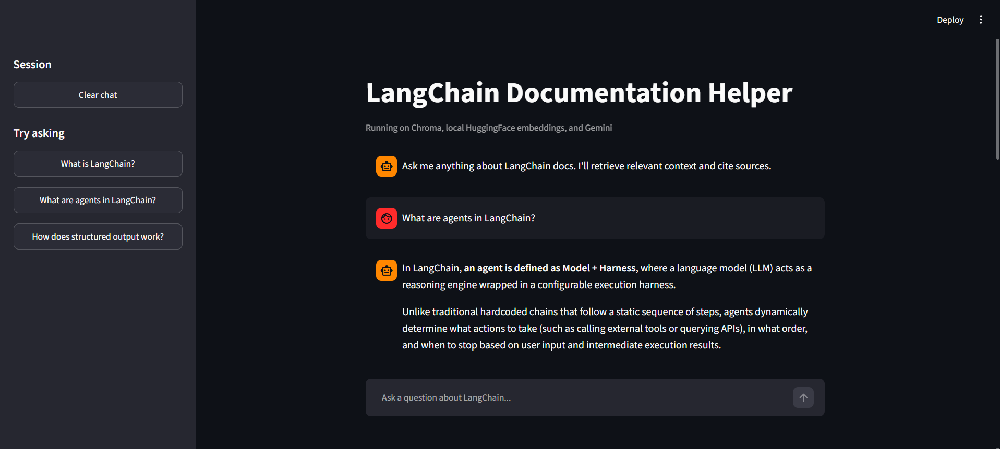
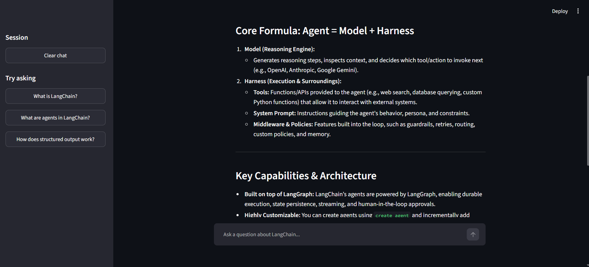
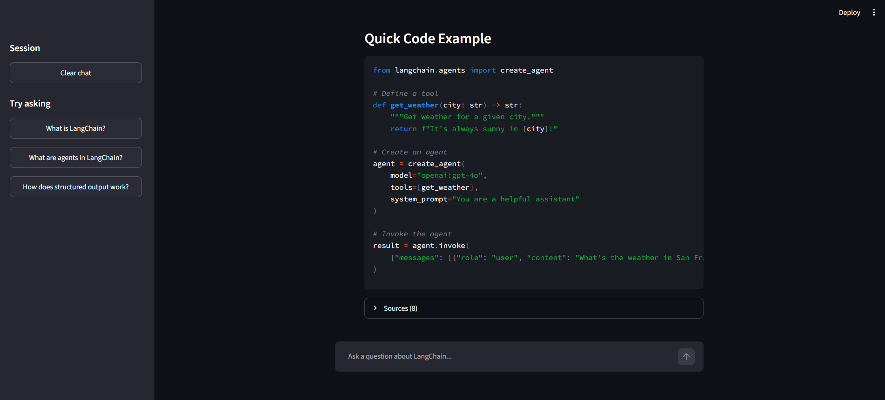
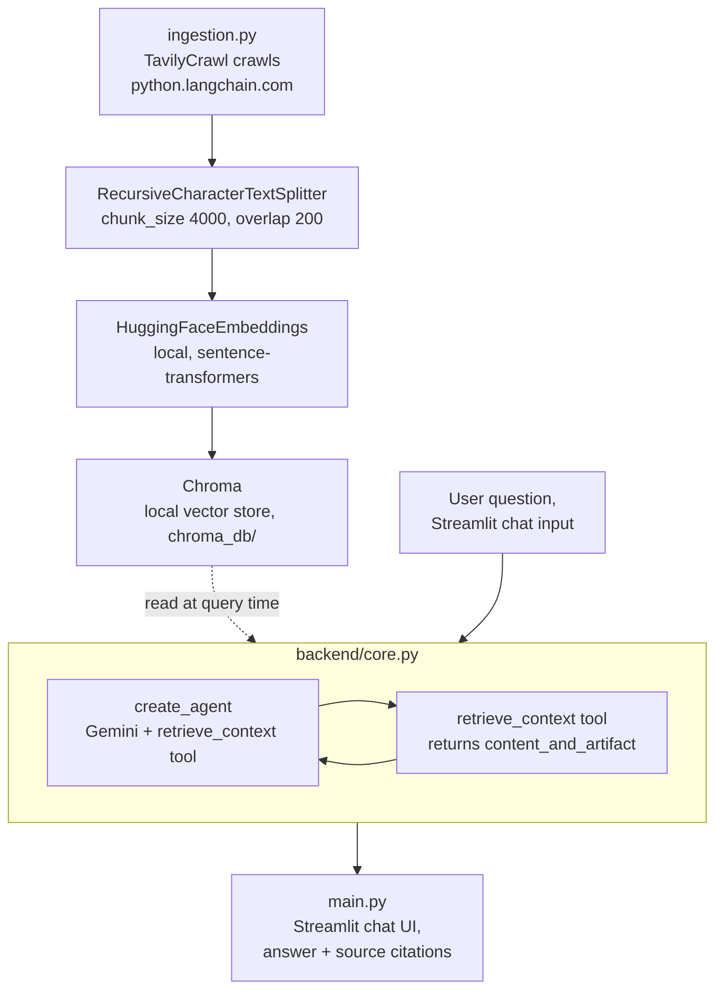

# Documentation Helper

A Retrieval Augmented Generation chat application that answers questions about LangChain's documentation, built with a Streamlit interface, a Tavily-crawled knowledge base, and an agent that retrieves and cites real sources before answering.

This project is a personal, from-scratch rebuild of a separate-repo lesson from a Udemy Agentic AI course. It is not a fork, every file was written independently while following the lesson session by session, with a different underlying stack by choice, explained below.

## What it does

Ask a question about LangChain in the chat interface, the agent retrieves the most relevant chunks of real LangChain documentation from a local vector store, answers using only that retrieved context, and shows exactly which pages it pulled the answer from.

## Screenshots

### Chat interface


### Answer 


### Answer


### Answer with cited sources




Two phases, run at different times. **Ingestion** (`ingestion.py`) runs occasionally, whenever the documentation source needs refreshing, it crawls, splits, embeds, and stores the knowledge base once. **Serving** (`backend/core.py` plus `main.py`) runs every time a user asks a question, it retrieves relevant chunks from the already-built store and generates an answer.

## Files

| File | Role |
|---|---|
| `ingestion.py` | Crawls `python.langchain.com` with Tavily, splits the pages into chunks, embeds them locally, and stores them in Chroma. Run once, not part of the live chat flow. |
| `backend/core.py` | The RAG engine. Builds an agent with one retrieval tool, `retrieve_context`, and exposes `run_llm(query)`, which returns the answer plus the source documents used. |
| `backend/README.md` | Function-by-function and parameter-by-parameter documentation of `core.py`, written for interview review. |
| `main.py` | The Streamlit chat interface, calls `run_llm`, displays the conversation, and shows a collapsible source list under each answer. |

## Tech stack, and why it differs from the instructor's

| Original (instructor) | Used here | Why |
|---|---|---|
| `OpenAIEmbeddings` | `HuggingFaceEmbeddings` (`sentence-transformers/all-MiniLM-L6-v2`) | Free, fully local, no API key, no daily limit |
| `PineconeVectorStore` | `Chroma` (local, `persist_directory`) | `app.pinecone.io` was confirmed unreachable across multiple days, networks, and devices, a routing issue outside my control, not fixable by troubleshooting further |
| `ChatOpenAI` | `ChatGoogleGenerativeAI` (`gemini-3.6-flash`, `model_provider="google_genai"`) | Matches the `GOOGLE_API_KEY` already used throughout this course, avoids OpenAI billing |
| Custom `logger.py` with colored output | Plain `print()` statements with `"*"*60` separators | Simpler, no extra dependency, same readability for a project this size |

This same local-first stack, Chroma plus local embeddings, is also discussed in `notes/` on the Agentic-AI repo as a working example of privacy-by-architecture, since no document content or query ever has to leave the machine it runs on.

## Setup

```bash
git clone https://github.com/Haneenmohammed1311/documentation-helper.git
cd documentation-helper
uv sync
```

Create a `.env` file with:
- GOOGLE_API_KEY=your_key_here
- TAVILY_API_KEY=your_key_here
- LANGSMITH_TRACING=true
- LANGSMITH_API_KEY=your_key_here
- LANGSMITH_PROJECT=documentation-helper
No `PINECONE_API_KEY` or `OPENAI_API_KEY` needed, neither is used in this version.

## Running it

**1. Build the knowledge base, run once:**
```bash
uv run python ingestion.py
```
This crawls the documentation site and populates `chroma_db/`. Takes a few minutes given the crawl depth. Re-run only when the source documentation needs refreshing.

**2. Launch the chat app:**
```bash
uv run streamlit run main.py
```
Opens in your browser. Ask a question about LangChain, get an answer grounded in the real, retrieved documentation, with sources shown underneath.

## What this project demonstrates

A full RAG pipeline from raw web crawling through to a usable chat interface, an agent that uses a `content_and_artifact` tool to separate what the model reads from what the application displays, and a privacy-conscious architecture that works identically whether the LLM call goes to Gemini's API or, with one line changed, to a fully local Ollama model, with the actual document data never leaving the local machine either way.

## Known fixes applied during this build

Documented in full in `backend/README.md`, summarized here: `init_chat_model` requires explicit `model_provider="google_genai"` for Gemini models, since LangChain's automatic inference defaults to `google_vertexai` instead; `response["messages"]` not `response["message"]`; Gemini's `response.content` can be a plain string or a structured list of blocks and must be guarded for both; `HuggingFaceEmbeddings`'s progress bar setting belongs inside `encode_kwargs`, not as a top-level argument.